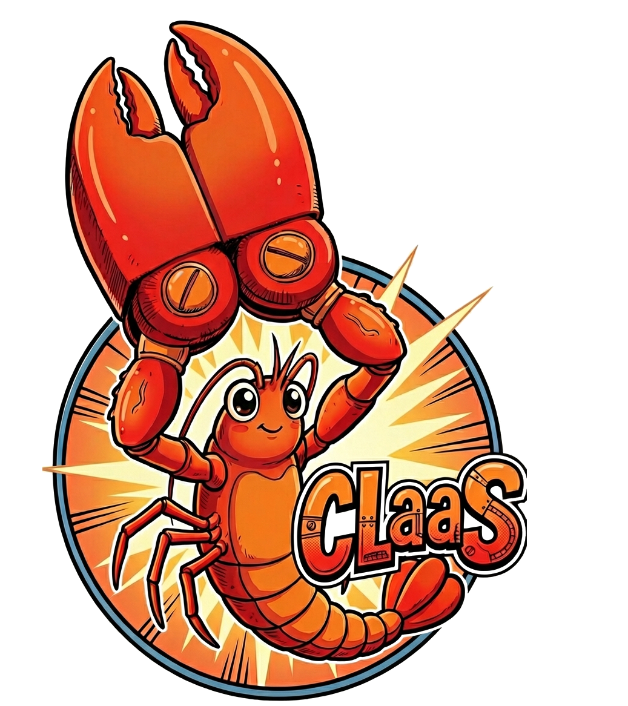
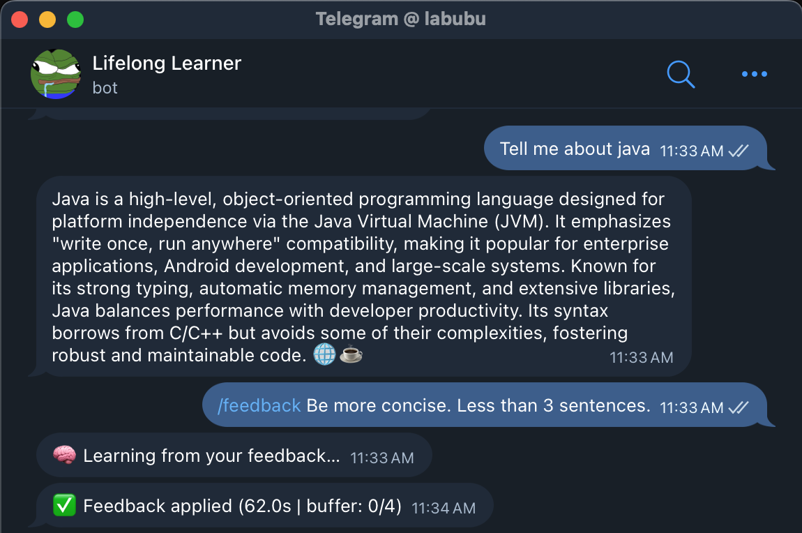
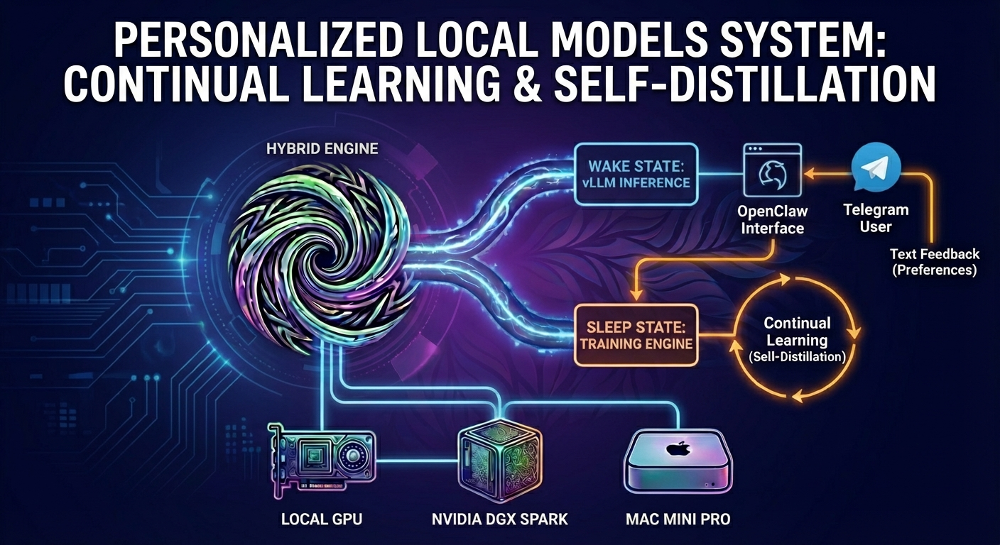
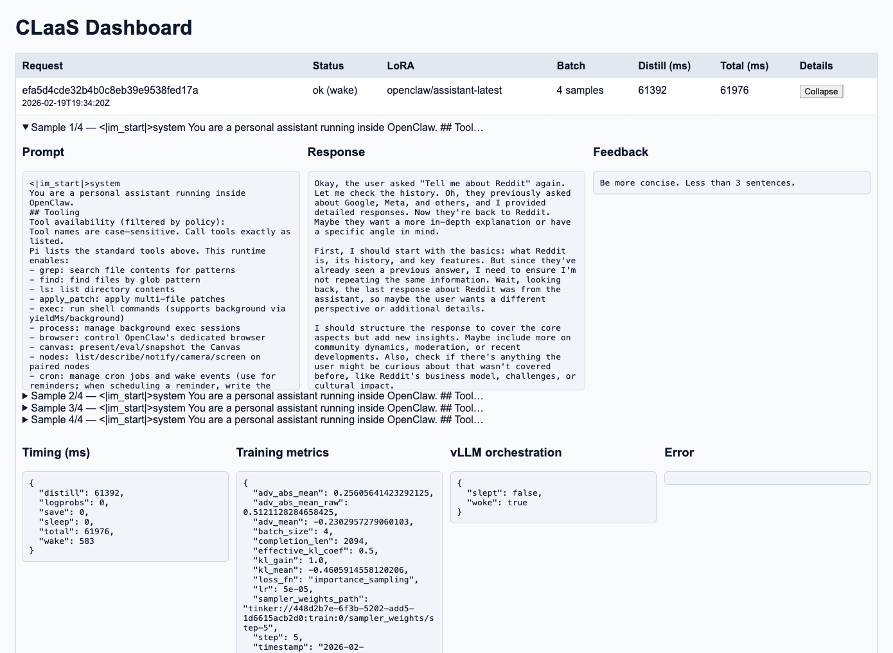
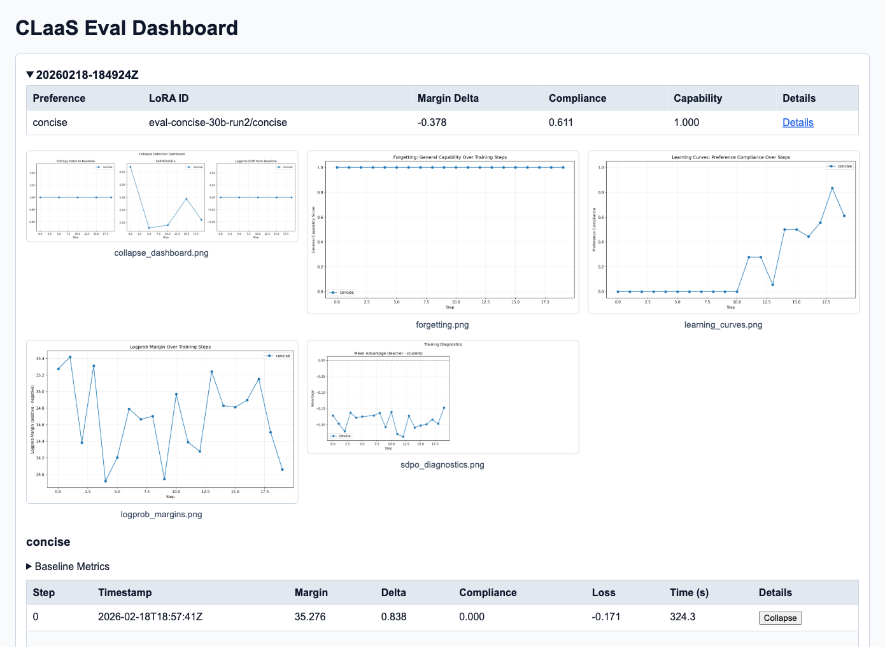

<p align="center">
  
</p>

# CLaaS: Continual Learning as a Service

Continual learning as-a-service (CLaaS) via self-distillation for OpenClaw. Personalize the model weights of your OpenClaw assistant using text feedback without model collapse.

<p align="center">
  
</p>

## Hybrid engine

The locally hosted request path is driven by a hybrid engine that switches between:

- **Serving mode**: route request traffic through vLLM (local or remote) for low-latency generation.
- **Update mode**: run a single self-distillation LoRA step using the provided feedback to adapt the adapter.

In practice, the flow is: request is answered by vLLM, then the engine performs (or schedules) the training step, and subsequent requests can use the updated adapter. The engine can prefer local or remote teacher inference depending on `teacher_mode`.



## Installation

**Prerequisites:** Python 3.11+, `uv`, and [Docker](https://docs.docker.com/get-docker/).

### Local (GPU)

Requires an NVIDIA GPU with >= 24 GB VRAM (L40S, A100, RTX 4090, RTX 5090, etc.) and the [NVIDIA Container Toolkit](https://docs.nvidia.com/datacenter/cloud-native/container-toolkit/install-guide.html). The native (non-Docker) setup is tested on an RTX 5090.

**Docker Compose (recommended):**

```bash
cd docker
cp .env.local.example .env
# Edit .env — set TELEGRAM_BOT_TOKEN (from @BotFather)
docker compose --profile local up --build
```

This brings up vLLM with Qwen3-8B, the CLaaS feedback API, and OpenClaw's Telegram gateway. See [`docker/README.md`](docker/README.md) for details.

**Manual install:**

```bash
uv sync --extra local
```

Then start vLLM and the API yourself. See [Quick Start](#quick-start) and [`scripts/openclaw-local/README.md`](scripts/openclaw-local/README.md) for the full supervised local stack.

If you use [Claude Code](https://claude.ai/claude-code), `/setup-local <TELEGRAM_BOT_TOKEN>` installs all deps and starts the full local stack automatically.

### Tinker (no GPU)

Uses the Tinker SDK for hosted distillation and inference. Requires a `TINKER_API_KEY`.

**Docker Compose (recommended):**

```bash
cd docker
cp .env.tinker.example .env.tinker
# Edit .env.tinker — set TELEGRAM_BOT_TOKEN and TINKER_API_KEY
docker compose -f docker-compose.tinker.yml --env-file .env.tinker up --build
```

**Manual install:**

```bash
uv sync --extra tinker
uv pip install --python .venv/bin/python --index-url https://download.pytorch.org/whl/cpu torch
```

If you use [Claude Code](https://claude.ai/claude-code), `/setup-tinker` deploys the Tinker Docker stack. Use `/clear-tinker-storage` to delete all Tinker checkpoints and free storage.

### Modal (remote GPU)

Runs distillation remotely on Modal (L40S). Requires a Modal account.

```bash
uv sync --extra local
uv run modal token new
```

Deploy:

```bash
# Set HF_TOKEN if using gated models
export HF_TOKEN=...
export CLAAS_BASE_MODEL_ID=Qwen/Qwen3-8B
uv run modal deploy -m claas.deploy
```

The deployed app exposes the same API at `https://your-app--claas-distill-fastapi-app.modal.run`. LoRAs are stored in the `claas-loras` Modal Volume.

If you use [Claude Code](https://claude.ai/claude-code), `/setup-modal` deploys the CLaaS distillation service to Modal.

## Quick Start

For manual (non-Docker) local setup:

```bash
# 1. Start vLLM with LoRA support
vllm serve Qwen/Qwen3-8B --host 0.0.0.0 --port 8000 \
  --enable-lora --lora-modules my-lora=/loras/user/my-lora-init

# 2. Start the CLaaS API
uv run uvicorn claas.api:web_app --host 0.0.0.0 --port 8080

# 3. Initialize a LoRA adapter
curl -X POST http://localhost:8080/v1/lora/init \
  -H "Content-Type: application/json" \
  -d '{"lora_id": "user/my-lora"}'

# 4. Send a feedback update
curl -X POST http://localhost:8080/v1/feedback \
  -H "Content-Type: application/json" \
  -d '{
    "lora_id": "user/my-lora-init",
    "prompt": "Write a function to calculate factorial",
    "response": "def factorial(n): ...",
    "feedback": "Good recursive solution"
  }'
```

For the full supervised local stack (vLLM + gateway + auto-restart, multi-LoRA, Telegram), see [`scripts/openclaw-local/README.md`](scripts/openclaw-local/README.md).

## Configuration

All configuration is via environment variables. See [`docker/README.md`](docker/README.md#configuration) for the full reference.

## Dashboard

The CLaaS API serves a built-in dashboard at `/v1/dashboard` showing recent feedback batches, training metrics, and timing breakdowns. Each row is a batch — expand it to see individual samples and detailed metrics.

<p align="center">
  
</p>

The eval dashboard at `/v1/eval-dashboard` displays results from running the eval harness against your model.

<p align="center">
  
</p>

## References

1. Hübotter et al. (2026). "Reinforcement Learning via Self-Distillation." arXiv:2601.20802
2. SDPO Reference Implementation: https://github.com/lasgroup/SDPO
3. Modal GPU Memory Snapshots: https://modal.com/blog/gpu-mem-snapshots
4. vLLM: https://github.com/vllm-project/vllm
5. PEFT/LoRA: https://github.com/huggingface/peft
6. Tinker SDPO training reference (continualcode): https://github.com/sdan/continualcode

## License

MIT
